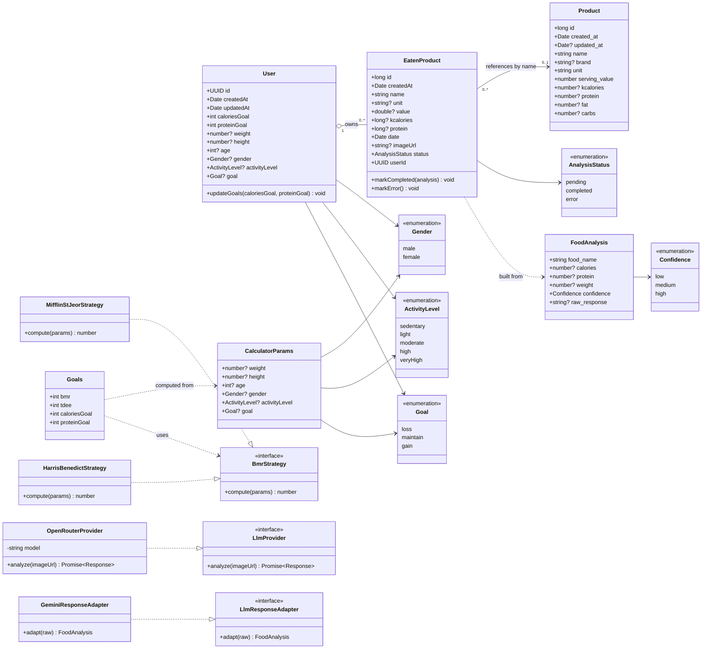
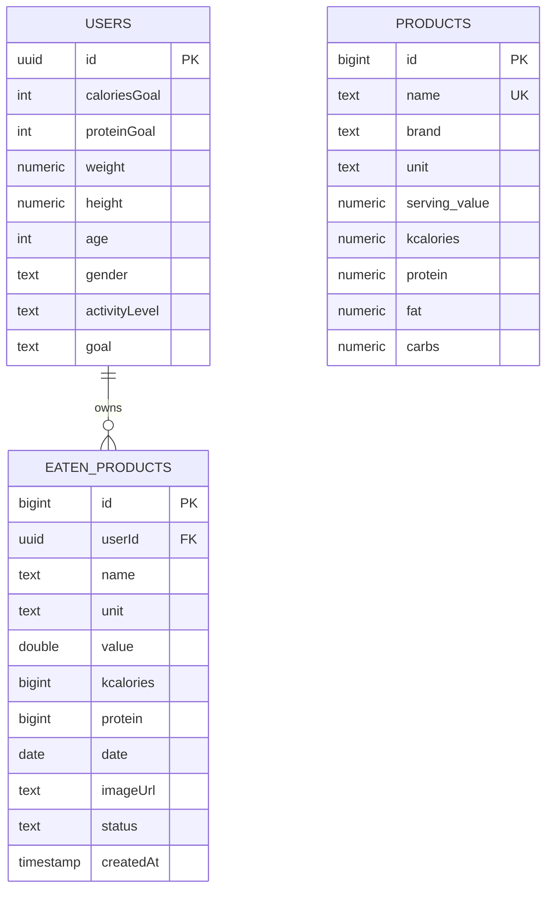

# 3. Модель предметной области

## 3.1. Диаграмма классов (UML)

## 3.2. Описание сущностей

### User

Доменная сущность пользователя. Связана 1-к-1 с записью `auth.users` (Supabase Auth). Хранит как цели по нутриентам (`caloriesGoal`, `proteinGoal`), так и параметры для их расчёта (`weight`, `height`, `age`, `gender`, `activityLevel`, `goal`).

**Инварианты:**

- `caloriesGoal > 0`, `proteinGoal > 0`;
- `gender ∈ {male, female}` (CHECK-constraint);
- `activityLevel ∈ {sedentary, light, moderate, high, veryHigh}`;
- `goal ∈ {loss, maintain, gain}`.

### EatenProduct

Запись о фактически съеденном продукте. Создаётся в трёх сценариях:

1. ручной ввод (статус сразу `completed`);
2. загрузка фото (статус `pending` → асинхронно `completed`/`error`);
3. выбор из справочника `Product` (статус `completed`).

**Состояния (`status`):**

- `pending` — фото загружено, ждём ответа LLM;
- `completed` — анализ успешен, КБЖУ заполнены;
- `error` — анализ провалился, для отображения «попробуйте ещё раз».

### Product

Справочник продуктов, общий для всех пользователей (RLS позволяет только чтение). Хранит «эталонные» КБЖУ на 100 г / 1 порцию.

### FoodAnalysis

Промежуточный объект — результат работы LLM-провайдера и адаптера ответа. Не хранится в БД отдельно; используется для маппинга на поля `EatenProduct`.

### CalculatorParams / Goals

Value Object'ы для расчёта целей. `CalculatorParams` — вход (анкета), `Goals` — выход (`bmr`, `tdee`, `caloriesGoal`, `proteinGoal`).

### Стратегии и провайдеры (паттерны GoF)

- `BmrStrategy` — интерфейс, реализации `MifflinStJeorStrategy` и `HarrisBenedictStrategy` (паттерн **Strategy**).
- `LlmProvider` — интерфейс LLM-провайдера, реализация `OpenRouterProvider` (паттерн **Factory Method**).
- `LlmResponseAdapter` — интерфейс адаптера ответа LLM, реализация `GeminiResponseAdapter` (паттерн **Adapter**).

Подробности — в [`docs/06-design-patterns.md`](06-design-patterns.md).

## 3.3. Связи и кратность

| Связь | Кратность | Тип | Комментарий |
|-------|-----------|-----|-------------|
| `User — EatenProduct` | 1 ◇— 0..* | агрегация | пользователь владеет своими записями; удаление пользователя удаляет записи (`ON DELETE CASCADE` через `auth.users`) |
| `EatenProduct — Product` | 0..* — 0..1 | ассоциация (по имени) | слабая ссылка: при ручном вводе можно указать произвольное имя |
| `EatenProduct — FoodAnalysis` | 0..1 — 0..1 | зависимость | `FoodAnalysis` существует только в рантайме Edge Function |
| `Goals — CalculatorParams` | 0..1 — 1 | зависимость | каждый расчёт целей выполняется по одному набору параметров |
| `Goals — BmrStrategy` | 0..1 — 1 | зависимость (Strategy) | стратегия выбирается клиентским кодом |

## 3.4. ER-эквивалент (схема БД)

