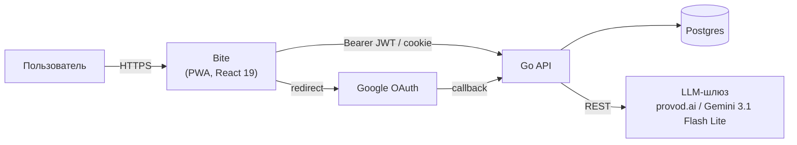
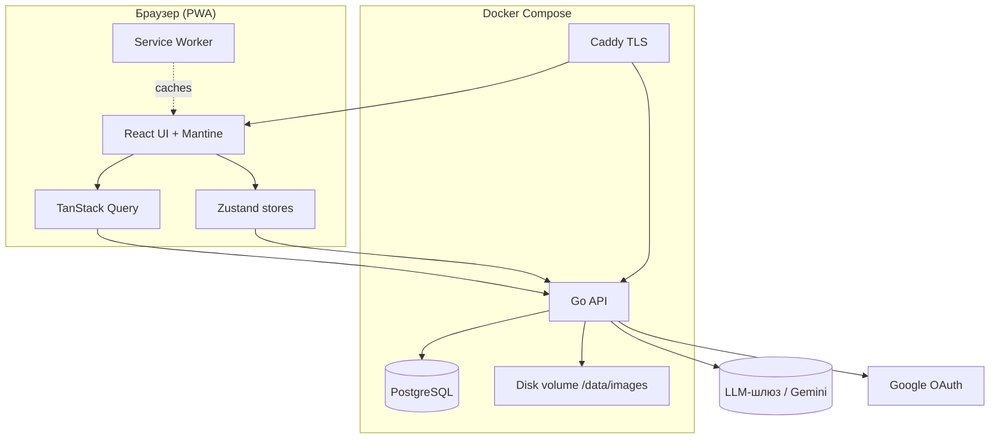
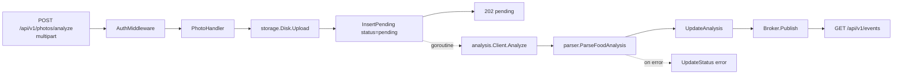
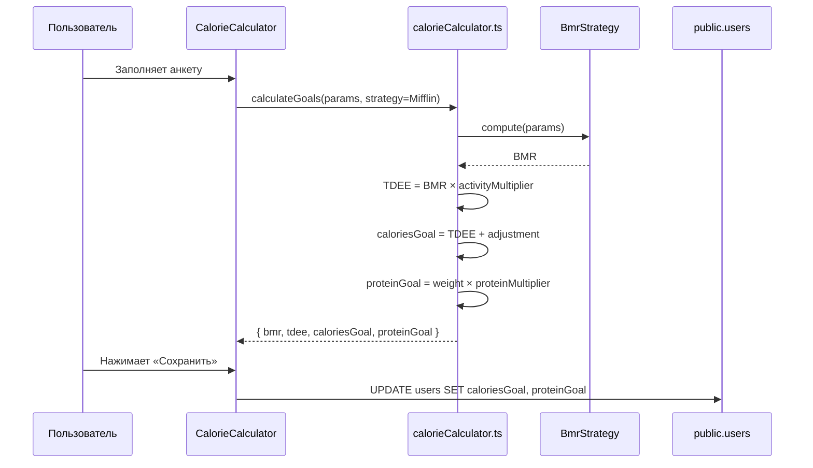

# 5. Архитектура системы

## 5.1. Архитектурный стиль

**Bite** построен по схеме **React PWA + Go API + Postgres**:

- толстый клиент на React 19 (Mantine UI, Zustand, TanStack Query) исполняется в браузере как Progressive Web App;
- персистентность, авторизация, файлы и SSE обеспечивает свой Go-бэкенд и Postgres в Docker Compose;
- анализ фото еды — фоновая горутина, которая вызывает LLM-шлюз (provod.ai, Gemini 3.1 Flash Lite) и пушит статус по SSE.

Такое разделение даёт три преимущества:

1. весь стек поднимается одной командой `docker compose up` (VPS или Raspberry Pi 5);
2. SSE заменяет ручной push для асинхронных результатов LLM;
3. ML-операции изолированы за интерфейсом `LLM` (см. Factory Method в [`06-design-patterns.md`](06-design-patterns.md)).

## 5.2. C4: System Context (L1)



**Внешние акторы:**

- **Пользователь** — конечный потребитель приложения через мобильный/десктоп-браузер.
- **LLM-шлюз** — внешний OpenAI-совместимый провайдер мультимодальных моделей; по умолчанию provod.ai с Google Gemini 3.1 Flash Lite, адрес и модель задаются `LLM_BASE_URL` / `LLM_MODEL`.
- **Google** — опциональный провайдер OAuth.

## 5.3. C4: Containers (L2)



| Контейнер | Технология | Назначение |
|-----------|-----------|------------|
| React UI | React 19, Mantine 8 | UI, маршрутизация, формы |
| Zustand store | Zustand 5 | Глобальное in-memory состояние (auth, выбранная дата) |
| TanStack Query | @tanstack/react-query 5 | Кэш серверных данных, оптимистичные мутации, персист в IndexedDB |
| Service Worker | vite-plugin-pwa | Offline-кэш статики и картинок |
| Caddy | Caddy 2 | TLS, единый origin, раздача статики |
| Go API | Go 1.25, chi | Авторизация, CRUD, анализ фото, SSE |
| PostgreSQL | Postgres 17 | Хранение домена и аккаунтов |
| Disk volume | Docker volume | Файлы фотографий `{userId}/photo-{ts}.{ext}` |

## 5.4. C4: Components — анализ фото (L3)



**Поток данных при загрузке фото:**

1. Клиент → `POST /api/v1/photos/analyze` (multipart: `photo`, `date`) с Bearer access-токеном.
2. `AuthMiddleware` проверяет JWT и кладёт `userId` в контекст.
3. `PhotoHandler` сохраняет файл на диск и вставляет запись со статусом `pending`.
4. Ответ 202 `{ id, imageUrl, status: "pending" }` уходит клиенту немедленно.
5. **В фоне** (горутина):
   - `analysis.Client.Analyze` отправляет фото в LLM-шлюз как data-URL.
   - `parser` нормализует JSON к `FoodAnalysis` (Adapter).
   - репозиторий обновляет запись (`completed` + КБЖУ или `error`).
6. SSE `GET /api/v1/events` доставляет событие клиенту.

## 5.5. Поток данных при расчёте целей



## 5.6. Структура исходного кода

```
bite/
├── src/
│   ├── api/                  TanStack Query хуки + сервисы
│   ├── components/           UI-компоненты (Mantine)
│   ├── pages/                Страницы (Home, History, Profile, Auth)
│   ├── stores/               Zustand stores
│   ├── lib/                  supabase client, queryClient
│   ├── utils/
│   │   ├── calorieCalculator.ts     // Strategy: BmrStrategy
│   │   ├── bmrStrategy.ts            // Mifflin + Harris-Benedict
│   │   ├── dateUtils.ts
│   │   ├── imageCompression.ts
│   │   └── viewTransition.ts
│   └── types/                Тип-определения, в т.ч. сгенерированные из БД
├── supabase/
│   ├── functions/
│   │   └── analyze-food-photo/
│   │       ├── index.ts                 // HTTP handler
│   │       ├── llm.ts                   // Factory: createLlmProvider
│   │       ├── llmProvider.ts           // интерфейс + OpenRouterProvider
│   │       ├── parser.ts                // вход в адаптер
│   │       ├── responseAdapter.ts       // Adapter: GeminiResponseAdapter
│   │       ├── auth.ts / database.ts / storage.ts / cors.ts / file-handler.ts / responses.ts / config.ts / types.ts
│   └── migrations/           SQL-миграции (RLS, триггеры)
├── docs/                     Курсовая работа: 9 markdown-файлов
└── scripts/                  Исследовательский пайплайн для датасета (вне scope курсовой)
```

## 5.7. Архитектурные решения (ADR-light)

| Решение | Альтернатива | Обоснование |
|---------|--------------|-------------|
| Supabase BaaS вместо собственного бэкенда | Express/Nest + Postgres | минимум кода, бесплатный tier, встроенный Realtime |
| Edge Function на Deno | Node-сервер | работает «из коробки» в Supabase, нет cold-start от 0 |
| OpenRouter вместо прямого Gemini | Прямой Google AI Studio | единая обвязка под разные модели + бесплатные кредиты |
| Realtime канал вместо polling | setInterval | мгновенное UI-обновление, нет лишних запросов |
| TanStack Query + persister | Redux Toolkit Query | кэш в IndexedDB, оптимистичные мутации без шаблонов |
| Zustand для глобального стора | Context API | проще, меньше повторных рендеров |
| Mantine UI | MUI / Chakra | хорошая поддержка форм и нотификаций, лёгкая темизация |
| Vitest | Jest | работает с тем же конфигом vite, ESM-нативный |
