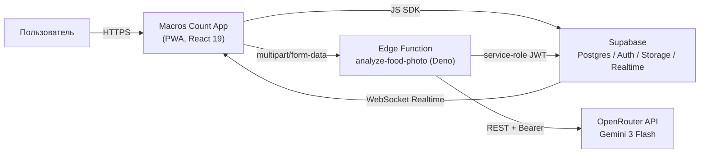
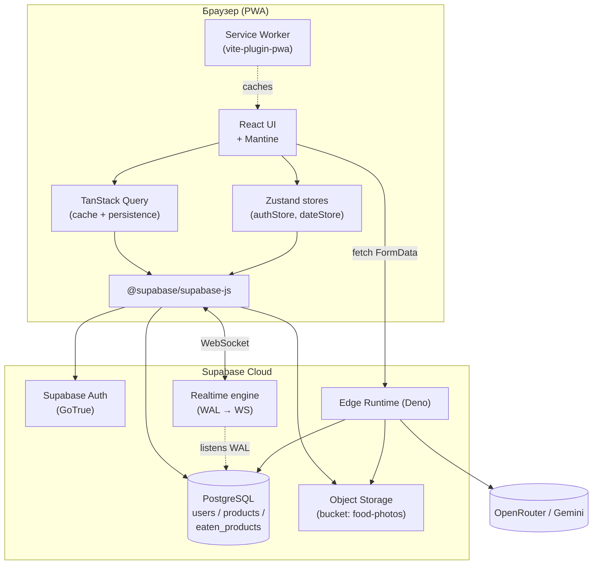
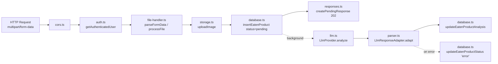
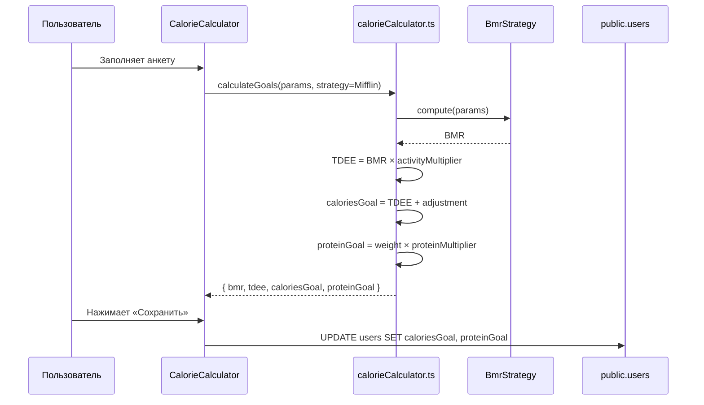

# 5. Архитектура системы

## 5.1. Архитектурный стиль

**Macros Count App** построен по схеме **Client-Side React PWA + BaaS (Supabase) + Serverless Edge Function**:

- толстый клиент на React 19 (Mantine UI, Zustand, TanStack Query) исполняется в браузере как Progressive Web App;
- персистентность, аутентификация, файловое хранилище и Realtime-канал обеспечивает Supabase (Postgres + Auth + Storage + Realtime);
- единственная server-side точка с произвольной бизнес-логикой — Deno-Edge Function `analyze-food-photo`, которая выполняет долгий вызов LLM в фоне и обновляет БД.

Такое разделение даёт три преимущества:

1. отсутствие выделенного сервера и контейнерной инфраструктуры (cost = 0 на старте);
2. встроенный Realtime-канал заменяет ручной push (WebSocket) для асинхронных результатов LLM;
3. ML-операции изолированы в одной функции, что упрощает замену провайдера (см. Factory Method в [`06-design-patterns.md`](06-design-patterns.md)).

## 5.2. C4: System Context (L1)



**Внешние акторы:**

- **Пользователь** — конечный потребитель приложения через мобильный/десктоп-браузер.
- **OpenRouter** — внешний шлюз для мультимодальных LLM (используется модель Google Gemini 3 Flash).
- **Supabase** — внешний управляемый BaaS-сервис.

## 5.3. C4: Containers (L2)



| Контейнер | Технология | Назначение |
|-----------|-----------|------------|
| React UI | React 19, Mantine 8 | UI, маршрутизация, формы |
| Zustand store | Zustand 5 | Глобальное in-memory состояние (auth, выбранная дата) |
| TanStack Query | @tanstack/react-query 5 | Кэш серверных данных, оптимистичные мутации, персист в IndexedDB |
| Service Worker | vite-plugin-pwa | Offline-кэш статики и Supabase-ответов (NetworkFirst) |
| Supabase Auth | GoTrue | JWT-аутентификация, триггер на создание `public.users` |
| PostgreSQL | Postgres 15 | Хранение домена + RLS-политики |
| Storage | S3-совместимое | Хранение фотографий по пути `<userId>/<filename>` |
| Realtime | Elixir-сервис | Доставка UPDATE-событий по подпискам |
| Edge Function | Deno 1.x | Серверная логика загрузки фото и обращения к LLM |

## 5.4. C4: Components — Edge Function `analyze-food-photo` (L3)



**Поток данных при загрузке фото:**

1. Клиент → `POST /functions/v1/analyze-food-photo` (multipart: `file`, `date`).
2. `cors.ts` обрабатывает preflight.
3. `auth.ts` создаёт Supabase-клиент с JWT и валидирует пользователя.
4. `file-handler.ts` извлекает файл и формирует путь `<userId>/<uuid>.<ext>`.
5. `storage.ts` загружает файл в bucket `food-photos`.
6. `database.ts` вставляет запись со статусом `pending`.
7. Ответ 202 + `{ id, imageUrl, status: "pending" }` уходит клиенту немедленно.
8. **В фоне** (`EdgeRuntime.waitUntil`):
   - `llm.ts` через `LlmProvider.analyze(imageUrl)` отправляет фото в OpenRouter (Factory Method).
   - `parser.ts` через `LlmResponseAdapter.adapt(raw)` нормализует JSON (Adapter).
   - `database.ts` обновляет запись (`completed` + поля КБЖУ или `error`).
9. Realtime-канал доставляет UPDATE-событие клиенту, UI снимает скелетон и показывает уведомление.

## 5.5. Поток данных при расчёте целей



## 5.6. Структура исходного кода

```
macros-count-app/
├── src/
│   ├── api/                  TanStack Query хуки + сервисы
│   ├── components/           UI-компоненты (Mantine)
│   ├── pages/                Страницы (Home, History, Profile, Auth)
│   ├── stores/               Zustand stores
│   ├── lib/                  supabase client, queryClient
│   ├── utils/
│   │   ├── calorieCalculator.ts     // Strategy: BmrStrategy
│   │   ├── bmrStrategy.ts            // Mifflin + Harris-Benedict
│   │   ├── dateUtils.ts
│   │   ├── imageCompression.ts
│   │   └── viewTransition.ts
│   └── types/                Тип-определения, в т.ч. сгенерированные из БД
├── supabase/
│   ├── functions/
│   │   └── analyze-food-photo/
│   │       ├── index.ts                 // HTTP handler
│   │       ├── llm.ts                   // Factory: createLlmProvider
│   │       ├── llmProvider.ts           // интерфейс + OpenRouterProvider
│   │       ├── parser.ts                // вход в адаптер
│   │       ├── responseAdapter.ts       // Adapter: GeminiResponseAdapter
│   │       ├── auth.ts / database.ts / storage.ts / cors.ts / file-handler.ts / responses.ts / config.ts / types.ts
│   └── migrations/           SQL-миграции (RLS, триггеры)
├── docs/                     Курсовая работа: 9 markdown-файлов
└── scripts/                  Исследовательский пайплайн для датасета (вне scope курсовой)
```

## 5.7. Архитектурные решения (ADR-light)

| Решение | Альтернатива | Обоснование |
|---------|--------------|-------------|
| Supabase BaaS вместо собственного бэкенда | Express/Nest + Postgres | минимум кода, бесплатный tier, встроенный Realtime |
| Edge Function на Deno | Node-сервер | работает «из коробки» в Supabase, нет cold-start от 0 |
| OpenRouter вместо прямого Gemini | Прямой Google AI Studio | единая обвязка под разные модели + бесплатные кредиты |
| Realtime канал вместо polling | setInterval | мгновенное UI-обновление, нет лишних запросов |
| TanStack Query + persister | Redux Toolkit Query | кэш в IndexedDB, оптимистичные мутации без шаблонов |
| Zustand для глобального стора | Context API | проще, меньше повторных рендеров |
| Mantine UI | MUI / Chakra | хорошая поддержка форм и нотификаций, лёгкая темизация |
| Vitest | Jest | работает с тем же конфигом vite, ESM-нативный |
