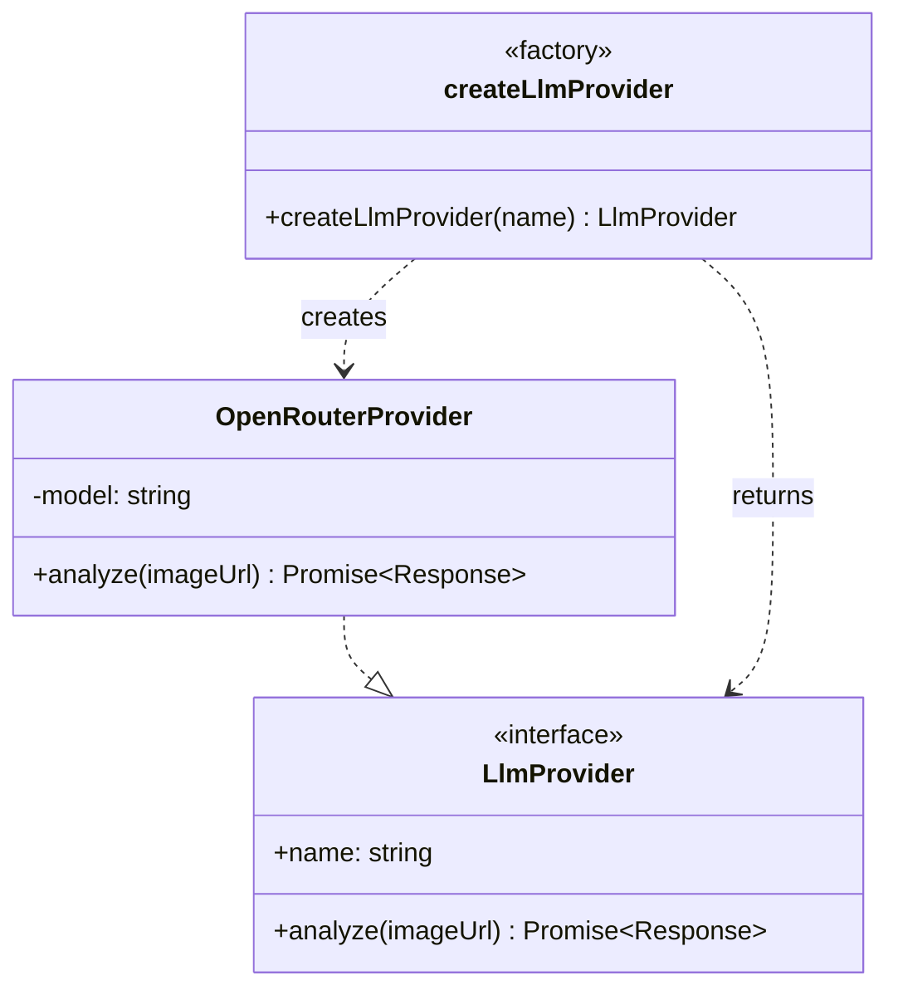
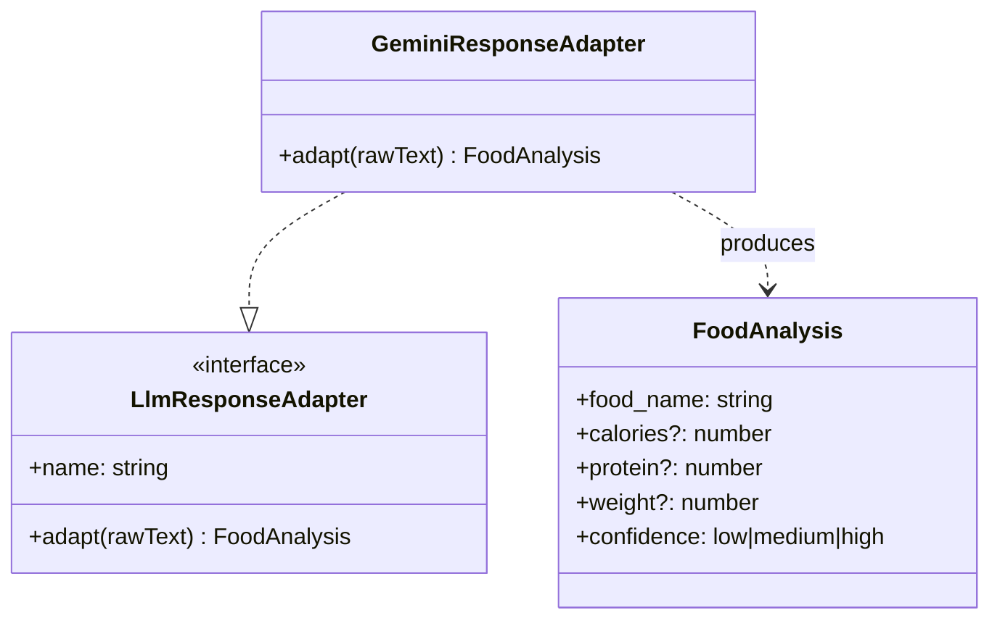
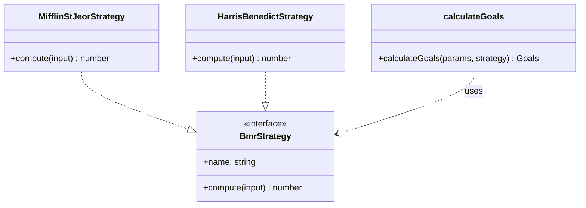

# 6. Применённые шаблоны проектирования (GoF)

В проекте явно выделены три шаблона — по одному из каждой категории классификации «Банды четырёх».

| Категория | Шаблон | Файл | Цель внедрения |
|-----------|--------|------|----------------|
| Порождающий | Factory Method | [`backend/internal/analysis/service.go`](../backend/internal/analysis/service.go), [`llm.go`](../backend/internal/analysis/llm.go) | Подмена LLM-провайдера без изменения вызывающего кода |
| Структурный | Adapter | [`backend/internal/analysis/parser.go`](../backend/internal/analysis/parser.go) | Нормализация «сырого» ответа LLM к доменной структуре `FoodAnalysis` |
| Поведенческий | Strategy | [`src/utils/calorieCalculator.ts`](../src/utils/calorieCalculator.ts), [`bmrStrategy.ts`](../src/utils/bmrStrategy.ts) | Выбор формулы расчёта BMR (Mifflin–St Jeor / Harris–Benedict) |

## 6.1. Factory Method — LLM-провайдеры

### Проблема

В исходной версии `llm.ts` URL, модель, заголовки и тело запроса были «зашиты» прямо в `analyzeFoodImage`. Чтобы переключиться на другую модель Gemini или сменить провайдера на, например, OpenAI/Anthropic, пришлось бы редактировать вызывающий `index.ts` или дублировать функцию.

### Структура



### До

```ts
// supabase/functions/analyze-food-photo/llm.ts (было)
export async function analyzeFoodImage(imageUrl: string): Promise<Response> {
    const openRouterApiKey = getOpenRouterApiKey();
    return fetch("https://openrouter.ai/api/v1/chat/completions", {
        method: "POST",
        headers: { /* ... */ },
        body: JSON.stringify({
            model: "google/gemini-3-flash-preview",
            messages: [/* ... */],
        }),
    });
}
```

### После

```ts
// llmProvider.ts
export interface LlmProvider {
    readonly name: string;
    analyze(imageUrl: string): Promise<Response>;
}

export class OpenRouterProvider implements LlmProvider {
    readonly name = "openrouter";
    constructor(private readonly model: string = "google/gemini-3-flash-preview") {}
    analyze(imageUrl: string): Promise<Response> { /* fetch ... */ }
}

export function createLlmProvider(name: LlmProviderName = "openrouter"): LlmProvider {
    switch (name) {
        case "openrouter": return new OpenRouterProvider();
        default: { /* exhaustive */ }
    }
}

// llm.ts (стало)
export async function analyzeFoodImage(
    imageUrl: string,
    providerName: LlmProviderName = "openrouter",
): Promise<Response> {
    return createLlmProvider(providerName).analyze(imageUrl);
}
```

### Эффект

- Добавление нового провайдера сводится к написанию одного класса + одной `case`-ветки.
- Тестировать `index.ts` теперь можно с помощью stub-провайдера, не выходя в сеть.
- Соблюдается принцип Open/Closed.

## 6.2. Adapter — нормализация ответа LLM

### Проблема

Шлюз возвращает `choices[0].message.content` как **строку**, формат которой зависит от модели:

- Gemini оборачивает JSON в markdown-блок ```json ... ```;
- OpenAI может вернуть «голый» JSON;
- любой LLM может «сорваться» в произвольный текст с комментариями.

Парсинг был зашит в одну функцию `parseLLMResponse` с парой regex'ов. Это создавало риск молчаливого падения при смене модели и затрудняло добавление новых форматов.

### Структура



### До

```ts
// parser.ts (было)
export function parseLLMResponse(responseText: string): FoodAnalysis {
    try {
        const jsonMatch =
            responseText.match(/```json\n?([\s\S]*?)\n?```/) ||
            responseText.match(/```\n?([\s\S]*?)\n?```/);
        const jsonText = jsonMatch ? jsonMatch[1] : responseText;
        return JSON.parse(jsonText.trim());
    } catch (error) {
        return { food_name: "Unknown", calories: 0, protein: 0, weight: 0, confidence: "low", raw_response: responseText };
    }
}
```

### После

```ts
// responseAdapter.ts
export interface LlmResponseAdapter {
    readonly name: string;
    adapt(rawText: string): FoodAnalysis;
}

export class GeminiResponseAdapter implements LlmResponseAdapter {
    readonly name = "gemini";
    adapt(rawText: string): FoodAnalysis {
        try {
            const jsonText = extractJsonFromMarkdown(rawText).trim();
            const parsed = JSON.parse(jsonText);
            const result: FoodAnalysis = {
                food_name: typeof parsed.food_name === "string" ? parsed.food_name : "Unknown",
                confidence: normalizeConfidence(parsed.confidence),
            };
            if (typeof parsed.calories === "number") result.calories = parsed.calories;
            if (typeof parsed.protein === "number") result.protein = parsed.protein;
            if (typeof parsed.weight === "number") result.weight = parsed.weight;
            return result;
        } catch { /* fallback */ }
    }
}

// parser.ts (стало)
export function parseLLMResponse(
    responseText: string,
    adapter: LlmResponseAdapter = createResponseAdapter("gemini"),
): FoodAnalysis {
    return adapter.adapt(responseText);
}
```

### Эффект

- Для каждой новой модели достаточно реализовать `LlmResponseAdapter` (например, `OpenAiResponseAdapter`).
- Защищено от подмешивания «лишних» полей в ответ — мы явно проверяем типы.
- Появляется доменная нормализация `confidence` (для устойчивости к опечаткам LLM).

## 6.3. Strategy — расчёт BMR

### Проблема

В исходном `calorieCalculator.ts` формула Mifflin–St Jeor была захардкожена. Согласно методическим рекомендациям, при наличии хронических состояний у пользователя предпочтительна формула Harris–Benedict. Стояла задача поддержать обе формулы без `if/else`, разбросанных по коду.

### Структура



### До

```ts
// src/utils/calorieCalculator.ts (было)
export function calculateBMR(weight, height, age, gender) {
    const baseBMR = 10 * weight + 6.25 * height - 5 * age;
    const genderAdjustment = gender === "male" ? 5 : -161;
    return baseBMR + genderAdjustment;
}
```

### После

```ts
// src/utils/bmrStrategy.ts
export interface BmrStrategy {
    readonly name: string;
    compute(input: BmrInput): number;
}

export class MifflinStJeorStrategy implements BmrStrategy {
    readonly name = "mifflin-st-jeor";
    compute({ weight, height, age, gender }: BmrInput): number {
        const base = 10 * weight + 6.25 * height - 5 * age;
        return base + (gender === "male" ? 5 : -161);
    }
}

export class HarrisBenedictStrategy implements BmrStrategy {
    readonly name = "harris-benedict";
    compute({ weight, height, age, gender }: BmrInput): number {
        if (gender === "male") return 88.362 + 13.397*weight + 4.799*height - 5.677*age;
        return 447.593 + 9.247*weight + 3.098*height - 4.33*age;
    }
}

// src/utils/calorieCalculator.ts (стало)
export function calculateGoals(
    params: CalculatorParams,
    strategy: BmrStrategy = defaultBmrStrategy,
) {
    const bmr = calculateBMR(/* ... */, strategy);
    /* ... TDEE / caloriesGoal / proteinGoal ... */
}
```

### Эффект

- Стратегия — fully-pure объект, легко тестируется (см. `calorieCalculator.test.ts`).
- Использующий код (`calculateGoals`) не меняется при добавлении новых формул.
- Обратная совместимость: вызовы без аргумента `strategy` работают как раньше.

## 6.4. Сводный эффект

| Метрика | До | После |
|---------|-----|-------|
| Кол-во точек, требующих правки при смене модели LLM | ≥ 2 (`llm.ts`, `parser.ts`) | 1 (новый класс + ветка фабрики) |
| Тестируемость расчёта целей | формула «вшита» в функцию | стратегии — отдельные unit-тесты |
| Возможность mock-провайдера в тестах Edge Function | нет | да (через `createLlmProvider`) |
| Соответствие принципам SOLID | OCP нарушается | OCP/DIP соблюдены |
