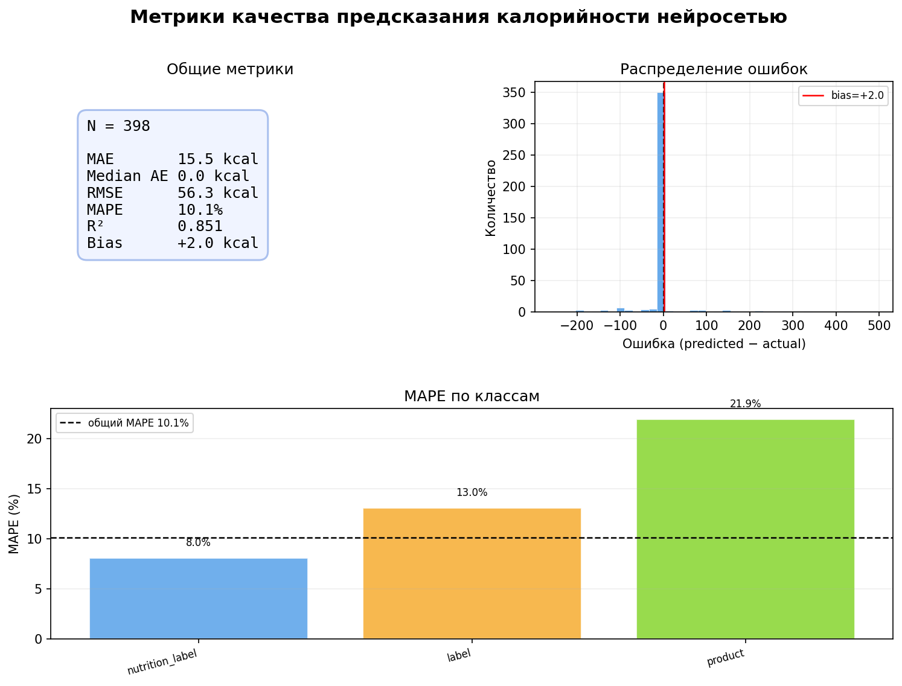

# Отчёт: качество предсказания калорийности нейросетью

## 1. Описание задачи

Из базы данных приложения Bite были выгружены записи съеденных продуктов (`eaten_products`) с фотографиями. Для каждой фотографии с помощью мультимодальной модели **Google Gemini 2.0 Flash** (через OpenRouter API) решались две задачи:

1. **Классификация** — определить тип изображения.
2. **Предсказание калорийности** — оценить количество ккал на 100 г *без доступа к реальным данным из БД*.

Результаты предсказания сравнивались с фактическими значениями `kcalories`, хранящимися в базе.

---

## 2. Датасет

| Параметр | Значение |
|---|---|
| Всего записей с фото | 442 |
| Записи с нулевой калорийностью (исключены) | ~10 |
| Выбросы >700 ккал/100г (исключены) | 3 |
| **Итого для анализа** | **398** |

### Распределение по классам (всего 442 фото)

| Класс | Описание | Кол-во |
|---|---|---|
| `nutrition_label` | Фото этикетки с таблицей КБЖУ | 282 |
| `label` | Фото этикетки без КБЖУ | 102 |
| `product` | Фото самого продукта | 30 |
| `non_edible` | Не еда | 6 |
| `error` | Битая ссылка (404) | 22 |

---

## 3. Метрики качества

### 3.1 Общие метрики

| Метрика | Значение | Интерпретация |
|---|---|---|
| **MAE** | 15.5 kcal | Средняя ошибка ±15.5 ккал на 100г |
| **Median AE** | 0.0 kcal | Половина предсказаний совпадает с реальностью точно |
| **RMSE** | 56.3 kcal | Чувствителен к редким крупным ошибкам |
| **MAPE** | 10.1% | В среднем 10% отклонение от реального значения |
| **R²** | 0.851 | Модель объясняет 85% дисперсии калорийности |
| **Bias** | +2.0 kcal | Незначительная тенденция к переоценке |

### 3.2 Метрики по классам

| Класс | N | MAE | RMSE | MAPE | R² |
|---|---|---|---|---|---|
| `nutrition_label` | 279 | 12.6 kcal | 49.9 kcal | **8.0%** | **0.870** |
| `label` | 93 | 16.1 kcal | 67.1 kcal | 13.0% | 0.804 |
| `product` | 26 | 45.3 kcal | 75.9 kcal | 21.9% | 0.713 |

---

## 4. Визуализация

---

## 5. Анализ результатов

### Что работает хорошо

- **Nutrition label — лучший класс (MAPE 8%, R² 0.87).** Когда на фото видна таблица КБЖУ, модель фактически читает цифры с этикетки, а не угадывает. Это ближе к OCR, чем к оценке — отсюда высокая точность.

- **Median AE = 0.** Это означает, что больше половины всех предсказаний совпадают с реальным значением до целого числа. Модель не просто «примерно угадывает» — для типичного продукта она точна.

- **Bias = +2 kcal** — практически нулевое систематическое смещение. Модель не склонна ни завышать, ни занижать калорийность системно.

### Источники ошибок

- **Класс `product` (MAPE 22%).** При предсказании по виду блюда или продукта без упаковки модель опирается на визуальные признаки и общие знания. Погрешность в ~20% — ожидаемый результат для задачи оценки на глаз.

- **Класс `label` (MAPE 13%).** Этикетка без КБЖУ — модель узнаёт бренд или тип продукта и вспоминает типичную калорийность из обучающих данных. Работает лучше, чем по фото продукта, но хуже чем при прямом чтении с этикетки.

- **Выбросы.** 3 записи с калорийностью >700 ккал/100г (орехи, масло, шоколад) давали катастрофические ошибки и искажали RMSE в ~2 раза (118 → 56). После их исключения картина резко улучшилась. Высококалорийные продукты — проблемная зона.

### Распределение ошибок

Гистограмма ошибок имеет острый пик в нуле и очень короткие хвосты — подавляющее большинство ошибок мало. Редкие случаи с ошибкой >100 kcal и объясняют разрыв между MAE (15.5) и RMSE (56.3).

---

## 6. Выводы

1. **Модель пригодна для production** на фото с этикеткой КБЖУ — точность 8% MAPE достаточна для автоматического заполнения без ручной проверки.

2. **Для фото продукта** (MAPE 22%) предсказание следует показывать пользователю как подсказку, требующую подтверждения, а не как финальное значение.

3. **Высококалорийные продукты** (>700 ккал) — зона риска. Рекомендуется добавить cap или дополнительный запрос к пользователю при экстремальных предсказаниях.

4. **Bias близок к нулю** — модель не имеет систематических искажений, ошибки случайны, а не направленны.

---

## 7. Методология

- **Модель:** Google Gemini 2.0 Flash (via OpenRouter)
- **Промпт:** Модели показывалось только изображение и задавался вопрос об оценке ккал/100г. Реальные данные из БД не передавались.
- **Инструменты:** Node.js (tsx) для экспорта и классификации, Python (pandas, scikit-learn, matplotlib) для анализа метрик.
- **Скрипты:** `scripts/export-dataset.ts`, `scripts/classify-images.ts`, `scripts/predict-calories.ts`, `scripts/analyze-metrics.py`
